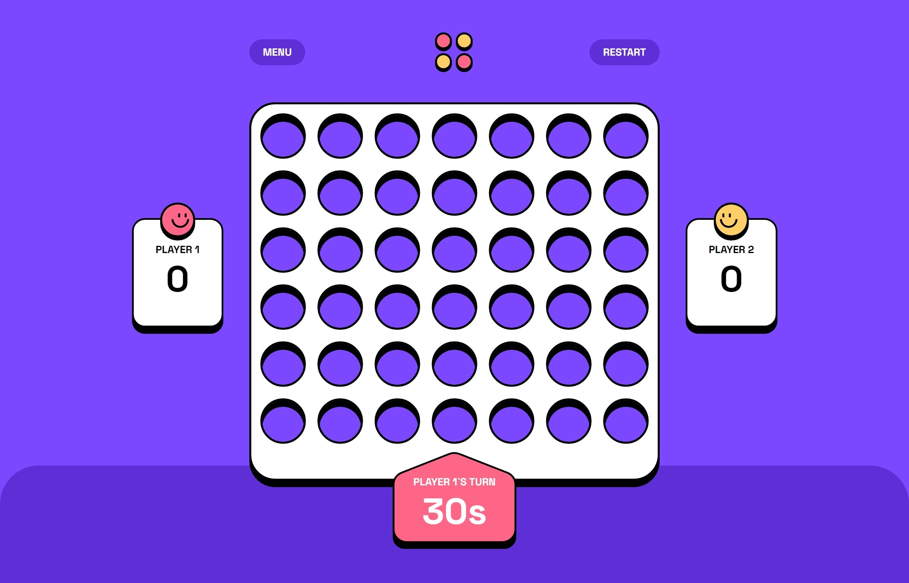

# Frontend Mentor - Connect Four game solution

This is a solution to the [Connect Four game challenge on Frontend Mentor](https://www.frontendmentor.io/challenges/connect-four-game-6G8QVH923s). Frontend Mentor challenges help you improve your coding skills by building realistic projects.

## Table of contents

- [Overview](#overview)
  - [The challenge](#the-challenge)
  - [Screenshot](#screenshot)
  - [Links](#links)
- [My process](#my-process)
  - [Built with](#built-with)
  - [What I learned](#what-i-learned)
  - [Continued development](#continued-development)
  - [Useful resources](#useful-resources)
- [Author](#author)
- [Acknowledgments](#acknowledgments)

**Note: Delete this note and update the table of contents based on what sections you keep.**

## Overview

### The challenge

Users should be able to:

- View the game rules
- Play a game of Connect Four against another human player (alternating turns on the same computer)
- View the optimal layout for the interface depending on their device's screen size
- See hover and focus states for all interactive elements on the page
- **Bonus**: See the discs animate into their position when a move is made
- **Bonus**: Play against the computer

### Screenshot



### Links

- Solution URL: [https://github.com/kamiliano1/four-games](https://github.com/kamiliano1/four-games)
- Live Site URL: [https://four-games.vercel.app/](https://four-games.vercel.app/)

## My process

### Built with

- Semantic HTML5 markup
- CSS custom properties
- Flexbox
- CSS Grid
- Mobile-first workflow
- [React](https://reactjs.org/) - JS library
- [Next.js](https://nextjs.org/) - React framework
- [Framer Motion](https://www.framer.com/motion/) - animations
- [TailwindCSS](https://tailwindcss.com/)
- [React Recoil](https://recoiljs.org/) - state management
- customHooks - for reset game and current Window width

### What I learned

This was the most challenging project so far. I had problems with creating proper logic for checking who is the winner. The hardest was with diagonal checking. I've created 3 separate functions for this,

```js
checkRows();
checkColumns();
checkDiagonals();
```

each of them is creating a new corresponding array, and this array is used with

```js
checkWinner([arrayToCheck]);
```

to check if the actual row, column, or diagonal is the winner.

To manage states I've used Recoil.
modalAtom.ts is managing which modal is open right now.
gameAtom.ts is taking care of game status, which player is turn, pause status, actual player score, who is the winner, and winner array to mark which fields are winner one.
boardAtom.ts is used to print each board field

Framer Motion was used to create drop animation on players' move

Custom Hooks
useWindowWidth.tsx was used to know the actual window width without writing logic on all required components.
useReset.tsx total of four buttons needs to reset the game, two continue with an actual score, PlayAgainButton.tsx, RestartButtonBig.tsx, and two to reboot the game QuitGameButton.tsx and RestartButtonSmall.tsx.

### Continued development

In the future, I may attempt to tackle the bonus task of playing against the computer.

## Author

- Website - [Kamil Szymon](https://github.com/kamiliano1)
- Frontend Mentor - [@kamiliano1](https://www.frontendmentor.io/profile/kamiliano1)
